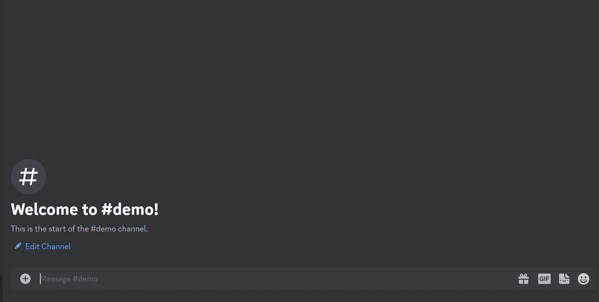
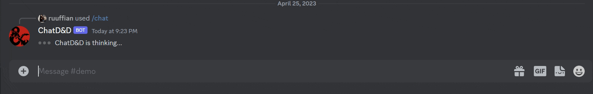
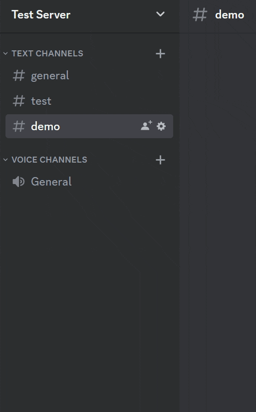

# ChatD&D

## Features

* `/chat [message]` Send a message to the Dungeon Master!
* `/private` Enable private mode.
* `/public`  Enable public mode.
* `/save` Saves the current campaign for later loading in case of an outtage.
* `/load` Loads the saved campaign data!
* `/replyall`  Toggle between reply all and normal mode.
* `/reset` Clear ChatGPT conversation history and optionally give the model a new starting prompt!
* `/roll` Roll XdY dice (X dice, Y sides) for your various DnD needs!
* `/help`  Show basic info on commands.

### Chat

### Mode

* `public mode (default)`  The bot replies are viewable by everyone.

  )

* `private mode` The bot's replies are *ephemeral* aka only the chat initiater can see the response.

  

* `replyall mode` The bot will ignore all slash commands and instead take every user message from a specific channel as bot input.

   > **Warning**
   > The bot will easily be triggered in `replyall` mode, please be responsible!

# Setup

## Install

1. **Paste the invite link into a browser**
    - `https://discord.com/api/oauth2/authorize?client_id=1075678176883249242&permissions=277025589248&scope=bot`
2. **Choose a server you are an admin of to add it to**

## Optional Setup

* `reply all` In order to use /replyall, you must provide the bot with a channel id, which it will use to identify the 
channel it should be looking for. Make sure to enable Discord's [Developer Mode](https://www.howtogeek.com/714348/how-to-enable-or-disable-developer-mode-on-discord/) in order to be able to do this.

    

* `reset` If you have a specific campaign in mind, or would like to prime the chatbot with a persona, you can do so with the `reset` command.
This command will reset the chatbot's state, and allow you to provide a new context for the bot. Get creative!
  
### Have a good campaign!

If you have any questions or run into any bugs, please feel free to open an Issue under the GitHub Issues tab.